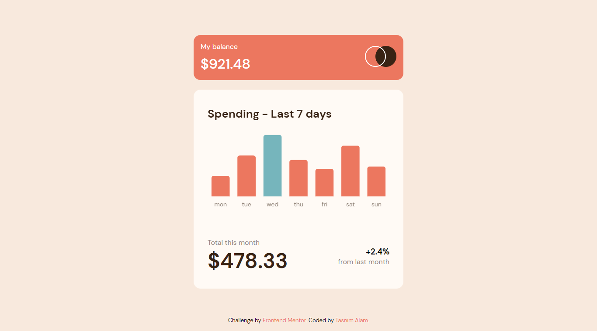

# Frontend Mentor - Expenses chart component solution

This is a solution to the [Expenses chart component challenge on Frontend Mentor](https://www.frontendmentor.io/challenges/expenses-chart-component-e7yJBUdjwt). Frontend Mentor challenges help you improve your coding skills by building realistic projects.

## Table of contents

- [Overview](#overview)
  - [The challenge](#the-challenge)
  - [Screenshot](#screenshot)
  - [Links](#links)
- [My process](#my-process)
  - [Built with](#built-with)
  - [What I learned](#what-i-learned)
  - [Continued development](#continued-development)
  - [Useful resources](#useful-resources)
- [Author](#author)

## Overview


### The challenge

Users should be able to:

- View the bar chart and hover over the individual bars to see the correct amounts for each day
- See the current day’s bar highlighted in a different colour to the other bars
- View the optimal layout for the content depending on their device’s screen size
- See hover states for all interactive elements on the page
- **Bonus**: Use the JSON data file provided to dynamically size the bars on the chart

### Screenshot



### Links

- Solution URL: [Repository](https://your-solution-url.com)
- Live Site URL: [Live site](https://your-live-site-url.com)

## My process

### Built with

- Semantic HTML5 markup
- CSS Grid
- [Chart JS](https://www.chartjs.org/docs/latest/) - Charting library for JavaScript

### What I learned

I learned to work with charts & got familiar with key concepts of Chart.js:

To see how you can add code snippets, see below:

```html
<div class="container">
  <canvas id="myChart"></canvas>
</div>
```

```js
let myChart = document.getElementById("myChart").getContext("2d");

fetch("data.json")
  .then((response) => response.json())
  .then((data) => {
    const labels = data.map((item) => item.day);
    const expenditure = data.map((item) => item.amount);

    Chart.defaults.font.family = "DM Sans";
    Chart.defaults.font.size = 14;

    let expenseChart = new Chart(myChart, {
      type: "bar",
      data: {
        labels: labels,
        datasets: [
          {
            label: "Expense",
            data: expenditure,
            backgroundColor: [ "#ec775f", "#ec775f", "#76b5bc", "#ec775f","#ec775f","#ec775f", "#ec775f",],
            borderRadius: 5,
            barPercentage: 1, 
            categoryPercentage: 0.7, 
          },
        ],
      },
      options: {
        responsive: true, 
        maintainAspectRatio: false,
        plugins: {
          title: {
            display: true,
            text: "Spending - Last 7 days",
            align: "start",
            font: {
              size: 26,
            },
          },
          legend: {
            display: false,
          },
        },

        scales: {
          x: {
            grid: {
              display: false,
            },

            border: {
              display: false,
            },
          },

          y: {
            display: false,
          },
        },
      },
    });
  });

```

### Continued development

I want to fix the tooltip. I want to add some spacing between my tooltip and top of the bars


### Useful resources

- [Chart JS](https://www.chartjs.org/docs/latest/) 

## Author
- Website - [Tasnim Alam](https://github.com/Tasnim005)
- Frontend Mentor - [Tasnim005](https://www.frontendmentor.io/profile/Tasnim005)

